<div align="center">

# Python chess with minimax AI

## Chess with graphics, a move log and an opponent that plays by the minimax method

### APPLICATION OF THE MINIMAX DECISION-MAKING METHOD IN GAME MODELS

#### Authors: A.V. Saganenko, A.A. Kuksin, A.V. Dagaev

#### Saint Petersburg State University of Telecommunications


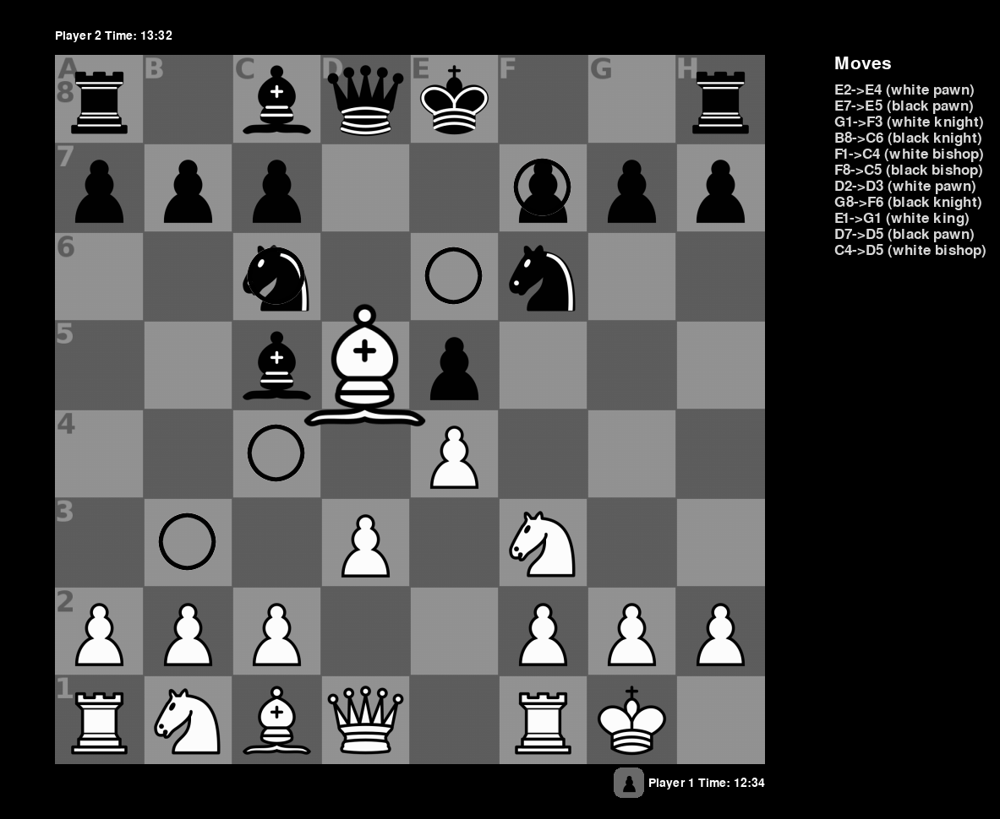

<sub>White has castled, the selected bishop on d5 shows every square it can go to, the captured pawn sits next to the clock and the log on the right lists the game so far.</sub>

</div>

### Description

The project was created to prove the applicability of the minimax method in game models. For this, work was carried out to formalize chess as a state space, to develop the game itself in Python, and to write an algorithm that plays it based on the minimax decision-making method. The algorithm uses board weighting and the alpha-beta pruning optimization, on top of that it reorders moves before searching them and remembers already evaluated positions in a transposition table.

Everything is written from scratch, there is no chess library involved. The whole thing is about 2000 lines of Python. PyGame does the drawing, NumPy is used only to mirror the weighting tables for black, screeninfo reports the display size so the window fits the screen. Each optimization is a separate layer over plain minimax, so the effect of every one of them can be measured separately, and the measurements are given below.

### Features

#### Game screen

The board is drawn in the middle of the window with a padding of 65 pixels on each side. Both clocks are placed in the corners next to their owner, and the pieces that a player has taken are laid out in a grey tray next to their clock. To the right of the board there is a strip with the log of the moves played. The window height is taken from the primary display, so the game fits the screen it is launched on, and the width of the window is that height plus the width of the log strip.

#### Selecting and moving

Click a piece to select it. The selected piece is drawn a bit larger than the others, and every square it may go to is ringed. Click one of those squares to make the move, click another own piece to select that one instead. Moves that would leave your own king under attack are refused, the piece simply returns to where it was.

<div align="center">
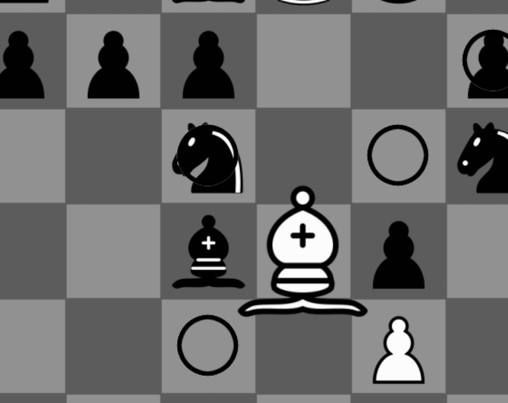
</div>

#### Move log

Every move that is really played is written to the strip on the right in the order it happened. The format is simple, the square it came from, the square it went to, and the piece in brackets.

```
E2->E4 (white pawn)
D7->D5 (black pawn)
E4->D5 (white pawn)
B8->C6 (black knight)
```

Castling is logged as the move of the king, en passant as the move of the capturing pawn, and a promotion as the move of the pawn that reached the last rank. Only real moves get there, the positions that the search walks through while thinking are not logged. When the list becomes longer than the strip is tall, the oldest lines fall off the top, so the last move is always the bottom one.

<div align="center">
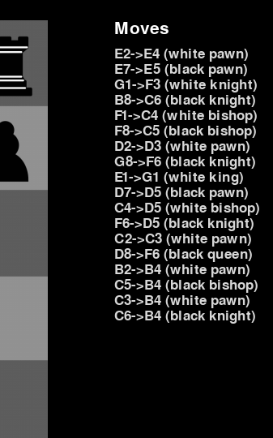
</div>

#### Castling, en passant and promotion

Castling is offered as an ordinary king move of two squares, and only when it is really allowed. Neither the king nor that rook may have moved before, the squares between them must be empty, and the king may not be under check, pass through an attacked square or land on one. When the king is moved, the rook is moved along with it.

<div align="center">
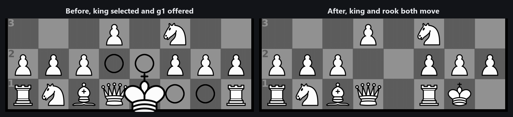
</div>

En passant works in both directions. The board remembers the square that a pawn jumped over on its double move, and only during the next half-move a pawn standing next to it may take it. When a pawn reaches the last rank the game stops and asks what it becomes. The AI does not get asked anything, it always takes a queen, because there is no player to ask in the middle of a search.

<div align="center">
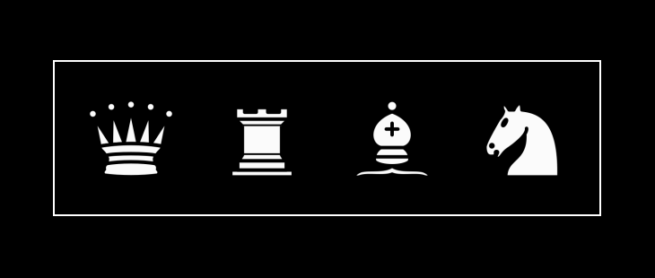
</div>

#### Check, clocks and the end of the game

While a king is under attack, a banner is shown on the side of its owner.

<div align="center">
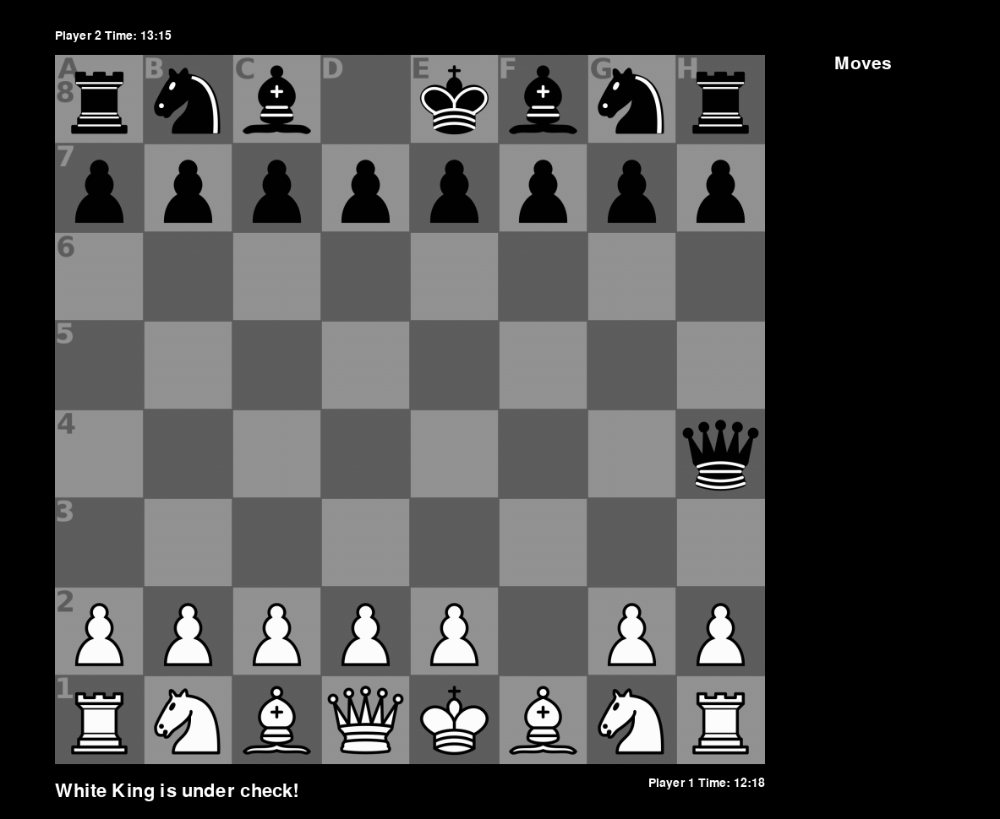
</div>

Each player has their own clock, it counts down only while it is that player's turn, and the game ends when one of them runs out. The other ways to end it are the surrender key and, in the hotseat mode, a draw that both players vote for. The result screen shows who won and how long the game took, from there the game can be restarted or closed.

<div align="center">
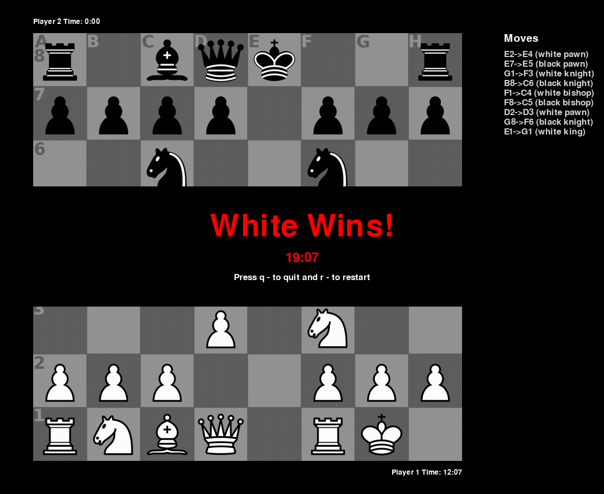
</div>

The hotkeys are listed on the screen that is shown before the game starts.

<div align="center">
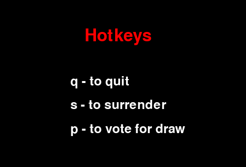
</div>

| Key | Action |
|:---:|--------|
| `q` | Quit |
| `s` | Surrender |
| `p` | Vote for a draw, hotseat mode only, both players have to vote |
| `r` | Restart, from the result screen |

#### Visual sets

The pieces, the board texture and the selection rings can be replaced without touching the code. Put the files into a numbered subfolder of `resources/images/` and name that number in the configuration.

1. Create `resources/images/<n>/`, where `<n>` is an integer.
2. Put all 14 files there, 12 piece sprites (`w_` and `b_` for `pawn`, `knight`, `bishop`, `rook`, `queen`, `king`), the board texture `eq_chessboard.png` and the two selection rings `b_select.png` and `b2_select.png`. The default set in `resources/images/` can be used as a template.
3. Write `visual_set=<n>` in `config.txt`.

If the folder or any single file of it is missing, a warning is logged and the whole default set is used, so sprites of two different themes never end up mixed on one board.

<div align="center">
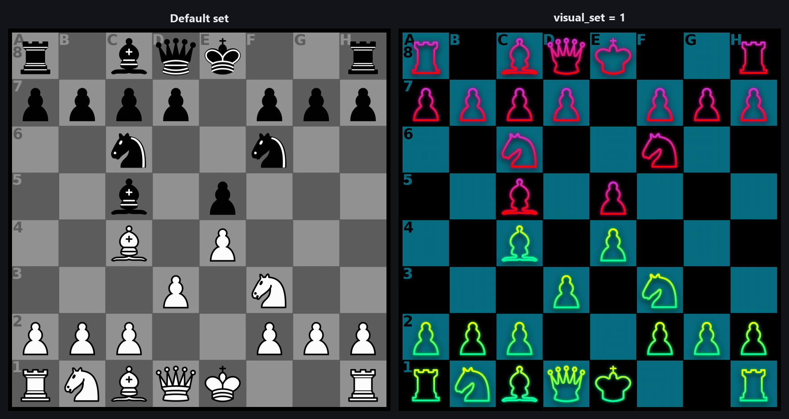
</div>

### Launch conditions

Be sure to have the packages listed in requirements.txt installed. Python 3.9 to 3.11 is what the game is tested on. Use any IDE able to interpret Python code, or launch it from the console. Launch from main.py.

```bash
pip install -r requirements.txt
python main.py
```

### Packages list

* PyGame is used to visualize chess, chessboard and all the menus.
* NumPy to mirror the weighting tables for the black side.
* Screeninfo to get information about display, so the game window will be fit in.

### Configuration

For configuration use config.txt, it is read once at startup. Anything that is missing or written incorrectly falls back to its default value, so a damaged config file can never stop the game from launching.

```ini
[settings]
game_mode=0
difficulty=3
visual_set=1
time_restriction=15
freeze_time=3
```

| Parameter | Values | Default | Description |
|-----------|--------|:-------:|-------------|
| `game_mode` | `0` PvP hotseat, `1` PvE | `0` | Who plays black |
| `difficulty` | `0` to `3` | `0` | Strength of the AI, see [released algorithms](#released-algorithms) |
| `visual_set` | integer | `0` | Subfolder of `resources/images/` with an alternative set of sprites |
| `time_restriction` | `0.5` to `60000` | `15` | Clock of one player, in minutes |
| `freeze_time` | `0` to `10` | `3` | Delay on the hotkey screen before the game begins |

### Project structure

```
python-chess-minimax/
├── main.py                     Entry point
├── game.py                     PyGame loop, drawing, input handling, move log strip
├── config.txt                  Configuration
│
├── configuration/
│   └── flowingconfig.py        Defaults, parsing of config.txt, window geometry
│
├── gameobjects/                Rules and state
│   ├── board.py                Board state, moves, check detection, castling, move log
│   ├── piece.py                Base piece, sprites, drawing, selection
│   └── bishop|king|knight|pawn|queen|rook.py    Move generation of each piece
│
├── scripts/                    The playing algorithm
│   ├── algorithm.py            Minimax, alpha-beta, the four difficulty tiers
│   ├── evaluate.py             Material and positional weighting, MVV-LVA scoring
│   └── zobrist.py              Zobrist hashing
│
├── dialogs/                    Screens and menus
│   ├── start_screen.py         Hotkey screen before the game
│   ├── end_screen.py           Result screen
│   ├── promotion_menu.py       Choice of the promoted piece
│   └── fonts.py                Shared fonts
│
└── resources/                  Sprites, board textures, icons
```

### The algorithm

#### Board representation

The board is an 8 by 8 list of lists. An empty square holds the integer `0`, an occupied one holds a piece object that knows its color, its position and its cached list of moves. Row 0 is the eighth rank and column 0 is the a file, which is why the log converts `(6, 4)` into `E2`.

Every piece class implements its own `valid_moves(board)`. Those are pseudo legal moves, they respect blocking and capturing but they know nothing about the check on their own king. Legality is decided one level higher, the move is played, the king of the player who moved is tested for attack, and the move is taken back if the king turned out to be under it. `Board.update_moves()` refreshes the list of every piece and then adds the castling destinations to the kings. `Board.get_danger_moves(color)` collects all squares the opponent attacks, and that same list is used both for the check detection and for the castling conditions.

#### Evaluation

There are two weighting functions, both return the score from the point of view of the side that is asked, so a positive number is good for that side.

The simple one is pure material, difficulty 1 uses it.

$$E_{\text{simple}} = \sum_{p \,\in\, \text{own}} \text{value}(p) \;-\; \sum_{p \,\in\, \text{enemy}} \text{value}(p)$$

The advanced one adds the positional bonus of the square the piece stands on, difficulties 2 and 3 use it.

$$E_{\text{adv}} = \sum_{p \,\in\, \text{own}} \Big( \text{value}(p) + \text{PST}_{p}[r_p][c_p] \Big) \;-\; \sum_{p \,\in\, \text{enemy}} \Big( \text{value}(p) + \text{PST}_{p}[r_p][c_p] \Big)$$

The values of the pieces are given in centipawns, one pawn is 100.

| | Pawn | Knight | Bishop | Rook | Queen | King |
|---|:---:|:---:|:---:|:---:|:---:|:---:|
| **Value** | 100 | 320 | 330 | 500 | 900 | 20000 |

The king is worth 20000, which is not a real price of a piece but a way to make its loss outweigh everything else on the board. Because of that the search avoids the lines where the king can be taken, and that is what replaces a real checkmate detection here.

#### Piece square tables

Each type of piece carries its own table of positional bonuses, one number per square. The tables say the usual things, that knights belong in the center, that pawns should move forward, that the king should sit behind its pawns while there are still pieces on the board. They are written from the point of view of white, the tables for black are made once at import with `numpy.flipud`.

<div align="center">
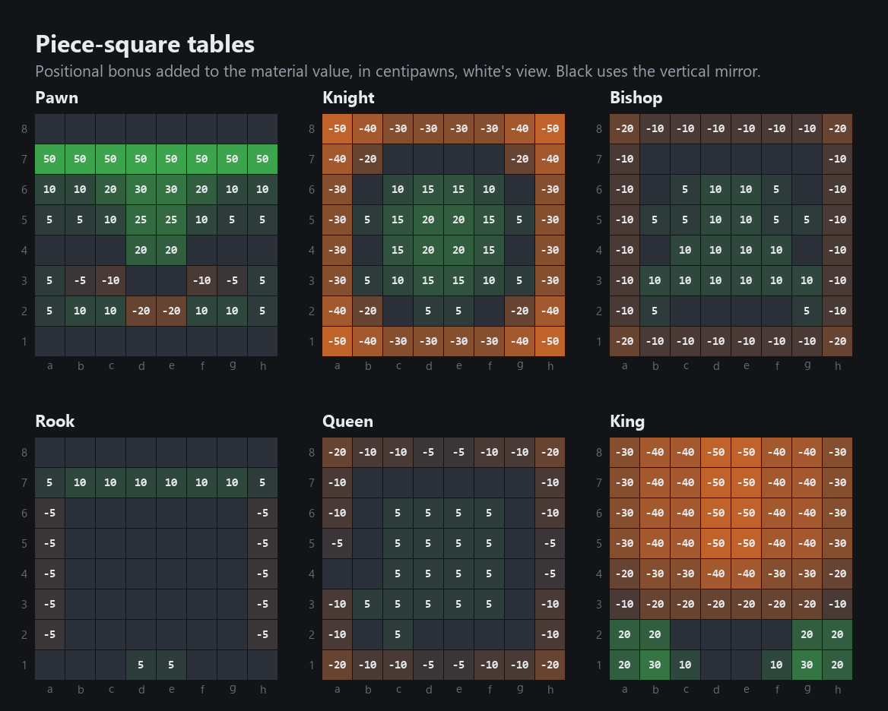
</div>

#### Minimax

The search assumes that both sides play the best move they can see. The engine maximizes its own score and the opponent minimizes it. For a state $s$ and remaining depth $d$ this is

$$
f(s, d) =
\begin{cases}
\text{evaluate}(s) & d = 0 \\[4pt]
\displaystyle\max_{m \,\in\, M(s)} f\big(s \cdot m,\; d-1\big) & \text{maximizing ply} \\[10pt]
\displaystyle\min_{m \,\in\, M(s)} f\big(s \cdot m,\; d-1\big) & \text{minimizing ply}
\end{cases}
$$

where $M(s)$ is the set of legal moves in that state and $s \cdot m$ is the state after the move $m$ is played.

<div align="center">
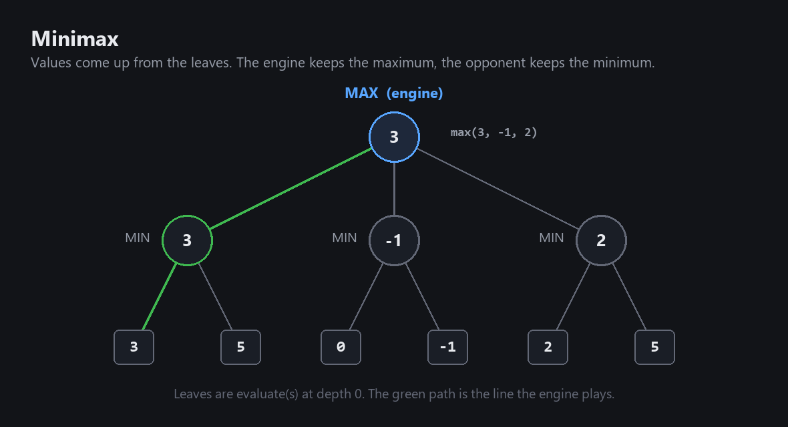
</div>

With a branching factor $b$ and depth $d$ plain minimax visits $O(b^d)$ leaves. In chess $b$ is around 30, which is why the third ply is already expensive.

#### Alpha-beta pruning

Alpha-beta carries two bounds through the search. Alpha is the best value the maximizing side can already guarantee, beta is the best the minimizing side can already guarantee. As soon as beta is not greater than alpha, the rest of the moves in that node cannot change anything anymore and they are skipped.

$$
\text{cut when } \beta \le \alpha,
\qquad
\alpha \leftarrow \max(\alpha, v),
\qquad
\beta \leftarrow \min(\beta, v)
$$

<div align="center">
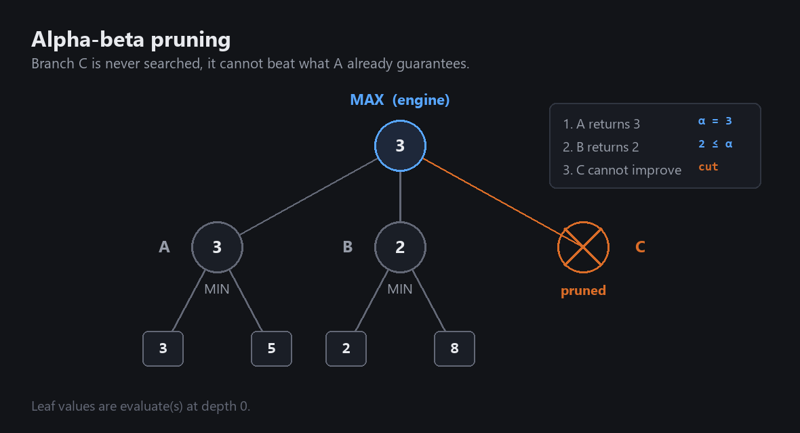
</div>

The answer is the same as the one plain minimax gives, pruning only removes the branches that could not have changed it. That is checked directly against an unpruned reference search, the numbers are in [measured results](#measured-results). In the best case the cost falls to $O(b^{d/2})$, and that is what makes the third ply affordable at all.

#### Move ordering, MVV-LVA

Alpha-beta cuts well only when good moves are looked at first, because a good move found early raises alpha and lets everything after it be cut. So before a node is searched, its moves are sorted by the most valuable victim and the least valuable attacker.

$$\text{score}(m) = \text{value}(\text{victim}) - 0.1 \cdot \text{value}(\text{attacker})$$

Quiet moves, the ones that take nothing, get a score of $-1$ and are searched last. Subtracting a tenth of the attacker breaks the tie between two captures of the same piece in favor of taking with the cheaper one.

For a black knight with several captures available the order comes out like this.

| Move | Victim | Attacker | Score | Order |
|------|:------:|:--------:|------:|:-----:|
| knight takes queen | 900 | 320 | 868 | 1 |
| knight takes rook | 500 | 320 | 468 | 2 |
| knight takes bishop | 330 | 320 | 298 | 3 |
| knight takes pawn | 100 | 320 | 68 | 4 |
| knight to e5 | | | -1 | last |

#### Zobrist hashing and the transposition table

The same position is reached by different orders of the same moves all the time, and there is no reason to search it twice. To recognize it, every position gets a 64 bit key.

A table of random 64 bit numbers is generated once at import and indexed by piece type, color and square, which is 6 by 2 by 64 numbers. The generator is seeded with 42, so two runs of the game hash the same position identically. The key of a position is the exclusive or of the numbers of all occupied squares.

$$H(s) = \bigoplus_{(p,\,c,\,q) \,\in\, s} Z[p][c][q]$$

Exclusive or is its own inverse, so the key of the position after a move is obtained from the previous key in three operations instead of walking over the whole board again. Remove the piece from the square it left, remove the piece that was taken, add the piece on the square it came to.

$$H' = H \oplus Z[p][c][\text{from}] \;\oplus\; Z[p_{\text{cap}}][c_{\text{cap}}][\text{to}] \;\oplus\; Z[p][c][\text{to}]$$

The result of a search is stored as a value, a depth and a flag, under the key of the position together with the depth and the side. The flag says how the stored value relates to the window it was found in.

| Flag | Meaning | What it is used for |
|------|---------|---------------------|
| `EXACT` | The real value, the node fell inside the window | Return it as it is |
| `LOWERBOUND` | The search failed high, the real value is not lower | Raise alpha |
| `UPPERBOUND` | The search failed low, the real value is not higher | Lower beta |

The table is limited to one million entries and is cleared completely when it fills up.

#### Make and unmake

The search does not copy the board. Every node plays its move on the same board and takes it back on the way out.

```python
undo = board.make_move(origin, move, colour)
if not board.piece_is_checked(colour):
    value = minimax(board, depth - 1, alpha, beta, ...)
board.undo_move(undo)
```

`make_move` returns a small token that holds everything needed to restore the position exactly.

```python
UndoMove = namedtuple("UndoMove", [
    "from_pos", "to_pos", "moving_piece", "captured_piece", "captured_pos",
    "was_first", "old_en_passant_target", "moving_had_moved", "castling_rook",
])
```

The square the piece came from and the one it went to, the taken piece together with the square it stood on, which is not the destination in the case of en passant, the first move flag of a pawn, the en passant target of the previous position, the castling right of the king or the rook that moved, and the displacement of the rook if the move was a castling.

This replaced a `copy.deepcopy(board)` that used to be made in every node. Copying the whole object graph that often was the heaviest thing in the search by a wide margin. Difficulty 3 used to need 6 to 9 seconds for a move, the same search now needs about 0.12 seconds in the starting position and about 0.26 seconds in the middlegame, and not a single evaluation changed because of it.

### Released algorithms

| Difficulty | Strategy | Weighting | Ordering | Table | Time for a move |
|:----------:|----------|-----------|:--------:|:-----:|----------------:|
| PvP | Player versus player | | | | |
| **0** | Random legal move | | | | about 3 ms |
| **1** | Best move, 1 ply | Simple, material only | | | about 5 ms |
| **2** | Minimax, depth 2 | Advanced, material and tables | MVV-LVA | yes | about 100 ms |
| **3** | Minimax, depth 3 and alpha-beta | Advanced, material and tables | MVV-LVA | yes | about 260 ms |

The times are medians over four positions of one opening, measured on a laptop, and they grow as the position opens up. Difficulty 3 needed from 0.12 to 0.35 seconds there.

Difficulty 1 falls back to a random choice when all of its moves are weighted the same, otherwise the engine would open with the same move in every single game. When the king of the engine is under check, every difficulty drops to a one ply search over the moves that get out of it, weighted with the advanced function, so the engine always escapes a check if it can escape it at all.

### Measured results

The same positions were replayed through an exhaustive minimax without any pruning and through both optimized searches, comparing the value they return and the number of leaves they evaluate.

Starting position, depth 3.

| Search | Value | Leaves | Against exhaustive |
|--------|:-----:|-------:|-------------------:|
| Exhaustive minimax | 50 | 8902 | |
| With alpha-beta | 50 | 1017 | -88.6 % |
| With alpha-beta and MVV-LVA | 50 | 1006 | -88.7 % |

After 1. e4 e5 2. Nf3, depth 3.

| Search | Value | Leaves | Against exhaustive |
|--------|:-----:|-------:|-------------------:|
| Exhaustive minimax | 115 | 23193 | |
| With alpha-beta | 115 | 2283 | -90.2 % |
| With alpha-beta and MVV-LVA | 115 | 1393 | -94.0 % |

All three searches return the same value in both positions, which is exactly the point, pruning and ordering are optimizations and not approximations. Ordering gives almost nothing in the quiet starting position, there is simply nothing to capture and so nothing to sort, and it cuts another 39 percent once the pieces come into contact.

<div align="center">
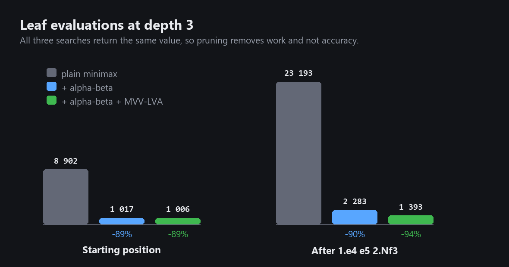
</div>

### Not implemented

* Checkmate and stalemate are not detected as a separate state of the game. A game ends on the clock, on surrender or on an agreed draw. The search plays toward taking the king, since the king is weighted at 20000, so the behavior is close to playing for a mate, but it is not the same thing.
* Threefold repetition and the fifty move rule are not counted.

### Building an executable

```bat
cicd\build.bat
```

The script builds a single file `dist\main.exe` with PyInstaller, packs `resources/` into it and copies `config.txt` next to it, so the settings stay editable after the build. Both `flowingconfig.py` and `piece.py` check `sys.frozen` and resolve their paths against the folder of the executable, which is what makes the packed build find its own files.

### Copyrights

1. Program license: GNU General Public License v2.0 or later, conditions listed in LICENSE (https://github.com/zeightOFFICIAL/python-chess-minimax/blob/master/LICENSE)
2. Copyright 2023 Artemii Saganenko, Alexander Kuksin.
3. Piece sprites, board textures and icons are stored in `resources/`. If any of them violates your rights, please inform me by any means possible and it will be taken down.
4. All the figures in `media/` are either screenshots of the running game, taken from the real drawing code, or diagrams drawn for this readme.
